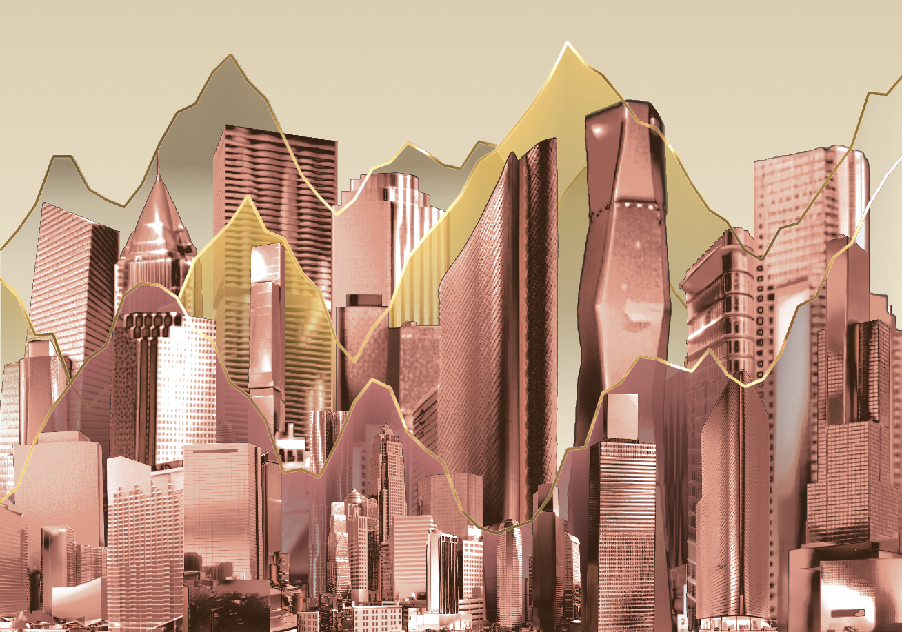

# 生成图片的样式

1. 显示整体背景(bg.png)
2. 显示最多4层画面
3. 每层画面包含一条折线, 只存在于折线下方的渐变背景, 还有若干建筑图片.
4. 每层画面中的折线由52个点组成, 横向平均分布, 高度来自传入的用户数据(范围[0,1])
5. 每层画面中的折线和line-gradient.jpg叠加后显示
6. 每层画面中折线下方的背景, 将layer-bg.png与一个特定颜色叠加后显示, 每层指定的叠加颜色不同
7. 每层画面横向显示13栋建筑, 建筑底部与生成图片的底部对齐, 高度与建筑所在位置的折线图上的点的高度一致, 宽度按图片自身的原比例缩放. 
8. 所有层内建筑都从"asia", "us", "china"三个大区中选择, 选择的具体逻辑见下方"建筑图片挑选逻辑"
9. 建筑图片可以指定和某一种颜色进行叠加显示. 所有层内建筑叠加的颜色为同一种.

1. 最终图片的分辨率可通过传入的参数来设定
2. 最终图片里一共包含4层, 每层可以独立开关显示(开关可通过传入的参数来调节). 
2. 每层内有52个点(数字可通过传入的参数调节), 形成折线图, 横向平均分布, 高度来自传入的数据(数据通过参数传入).
3. 每层折线都会与line-gradient.jpg进行叠加后显示.
3. 每层内都会横向显示13栋建筑(数字可通过传入的参数调节), 建筑底部与生成图片的底部对齐, 高度与建筑所在位置的折线图上的点的高度一致, 宽度按图片自身的原比例缩放.
4. 建筑按高度分为4档, 存储在imgset文件夹的h0-h4里, 
4. 建筑显示的原理为, 先计算出要显示建筑的高度, 再去